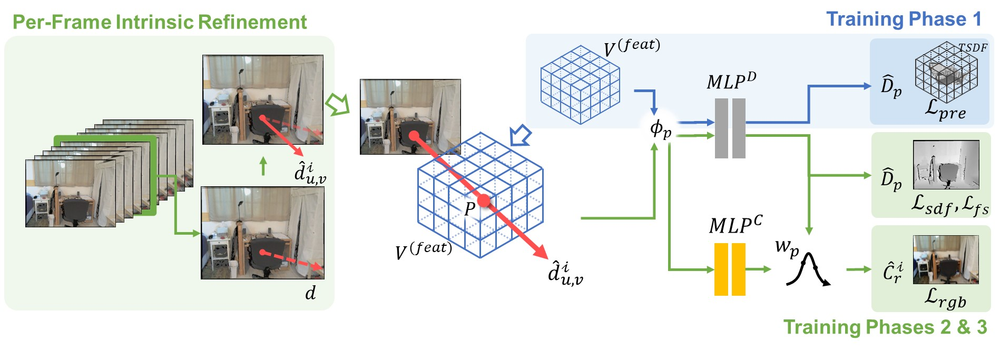

# FastSurf

### [Paper](https://arxiv) | [Project Page](https://rokit-healthcare.github.io/FastSurf/)

> FastSurf: Fast Neural RGB-D Surface Reconstruction using Per-Frame Intrinsic Refinement and TSDF Fusion Prior Learning <br />
> *Seunghwan Lee, Gwanmo Park, Hyewon Son, Jiwon Ryu, Han Joo Chae* <br />
> arXiv preprint



This repository contains the official implementation of ***FastSurf***, an accelerated neural radiance field (NeRF) framework that incorporates depth information for 3D reconstruction. The novel per-frame intrinsic refinement and classical TSDF Fusion prior learning schemes allow fast and high-quality 3D surface reconstruction.


## Installation

```
git clone https://github.com/ROKIT-Healthcare/FastSurf.git
cd FastSurf
pip install -r requirements.txt
```

Please also install the external Marching cube packages via:

```
cd external/NumpyMarchingCubes
python setup.py install
```

You also need to install tiny-cuda-nn pytorch extension at https://github.com/NVlabs/tiny-cuda-nn.

## Run
You can run an optimization using:

```
python optimize.py --config configs/<config_file>.txt
```

Make sure you run TSDF fusion for the pretraining step:

```
python tsdf_fusion.py --config configs/<config_file>.txt
```
After the optimization, you can extract the 3D surface mesh using:

```
python extract_mesh.py --config configs/<config_file>.txt --extckpt=<iteration>
```
You can evaluate the mesh using the following command (only applicable for the synthetic dataset):

```
python eval/evaluation.py \
    --config configs/<config_file>.txt \
    --extckpt=<iteration> \
    --gtdir=<path_to_gt_mesh>
```
## Data

The data follows the same structure of [Neural RGB-D Surface Reconstruction](https://github.com/dazinovic/neural-rgbd-surface-reconstruction):

```
<scene_name>            # args.datadir in the config file
├── depth               # raw (real data) or ground truth (synthetic data) depth images (optional)
    ├── depth0.png     
    ├── depth1.png
    ├── depth2.png
    ...
├── depth_filtered      # filtered depth images
    ├── depth0.png     
    ├── depth1.png
    ├── depth2.png
    ...
├── depth_with_noise    # depth images with synthetic noise and artifacts (optional)
    ├── depth0.png     
    ├── depth1.png
    ├── depth2.png
    ...
├── images              # RGB images
    ├── img0.png     
    ├── img1.png
    ├── img2.png
    ...
├── focal.txt           # focal length
├── poses.txt           # ground truth poses (optional)
├── trainval_poses.txt  # camera poses used for optimization
```

### Dataset
The paper uses two different datasets: [ScanNet V2](https://github.com/ScanNet/ScanNet) and the synthetic scene dataset used by [Neural RGB-D Surface Reconstruction](https://github.com/dazinovic/neural-rgbd-surface-reconstruction)

- ScanNet V2 can be downloaded from [the original author's page](https://github.com/ScanNet/ScanNet) by making a request.
- ScanNet V2 camera poses should be transformed to the OpenGL format before running.
- The synthetic scene dataset can be downloaded from the links ([dataset](http://kaldir.vc.in.tum.de/neural_rgbd/neural_rgbd_data.zip), [culled ground truth meshes](http://kaldir.vc.in.tum.de/neural_rgbd/meshes.zip)) provided in the repository of [Neural RGB-D Surface Reconstruction](https://github.com/dazinovic/neural-rgbd-surface-reconstruction).

## Citation

If you use this code in your research, please consider citing:

```
@article{Lee_2023_arXiv,
  title={FastSurf: Fast Neural RGB-D Surface Reconstruction using Dense Feature Grid and Per-Frame Intrinsic Refinement},
  author={Lee, Seunghwan and Park, Gwanmo and Son, Hyewon and Ryu Jiwon and Chae, Han Joo},
  journal={arXiv preprint arXiv:0000.00000},
  year={2023}
}
```

## Further information

The code is largely based on the PyTorch implementation of the CVPR 2022 Paper Neural RGB-D Surface Reconstruction.
- The original Neural RGB-D Surface Reconstruction: https://github.com/dazinovic/neural-rgbd-surface-reconstruction
- PyTorch implementation: https://github.com/HengyiWang/neural-rgbd-torch

The Marching Cubes implementation was adapted from the SPSG code by Dai et al.
- https://github.com/angeladai/spsg

The TSDF fusion implementation was adapted from the Python implementation of TSDF fusion by Zeng et al.
- https://github.com/andyzeng/tsdf-fusion-python